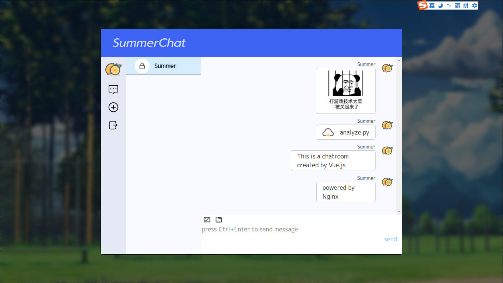
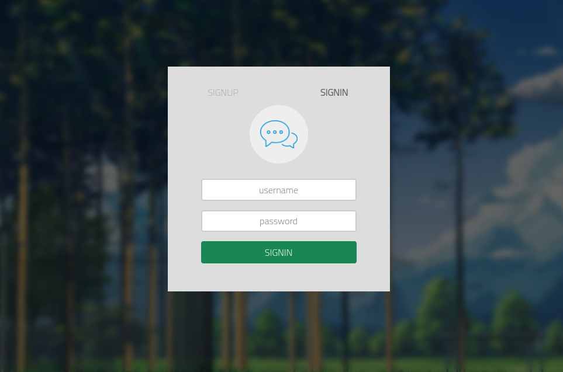

# Dingchat-PHP
A Dingtalk like chatroom written in PHP.





Features:
* support sending images and files
* ORM driven
* easy to run

## Get started

### Install 
```bash
./install.sh
```
This wille compile the frontend code and copy them to the backend folder.

### Start the server
```bash
./start.sh
```
Be sure that you have installed **docker-compose** before running it.

This will download some docker images and create corresponding containers automatically to tun the server.

The detailed information at listed at `./docker/docker-compose.yml`. You can modify this file to change the behavior of containers.

The configuration file for nginx is located at `./docker/default.conf`, please modify it to meet you needs.

### Stop the server

```bash
./stop.sh
```
